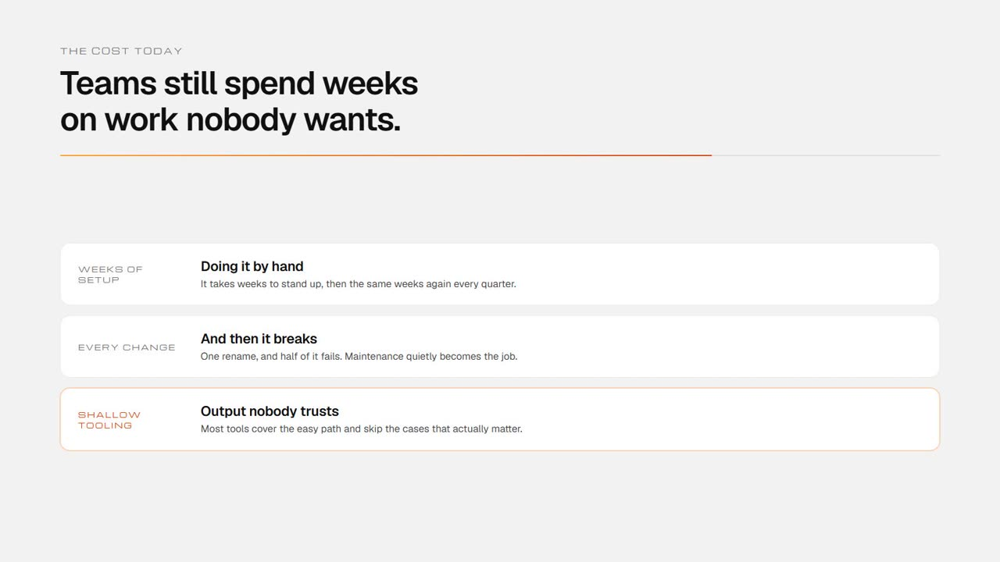
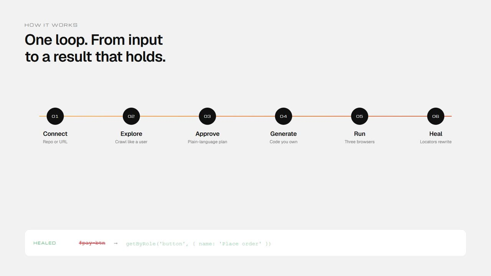
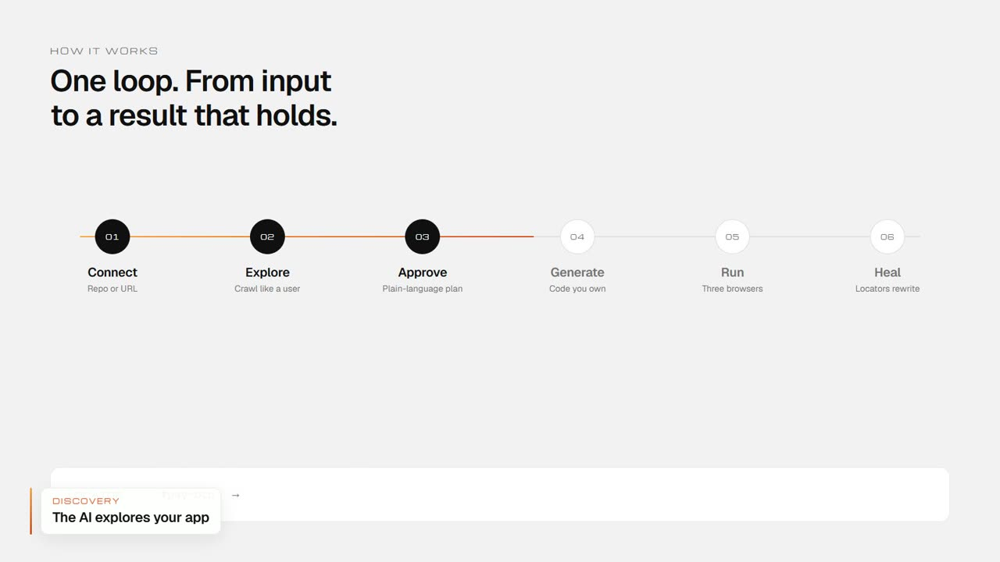
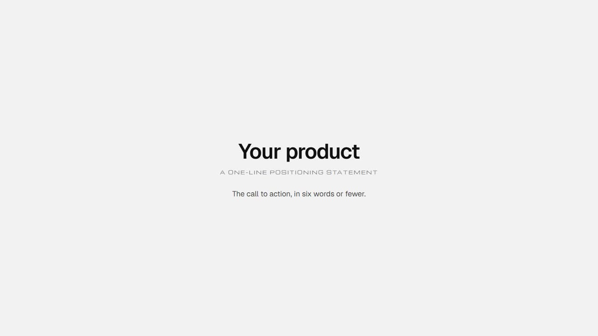
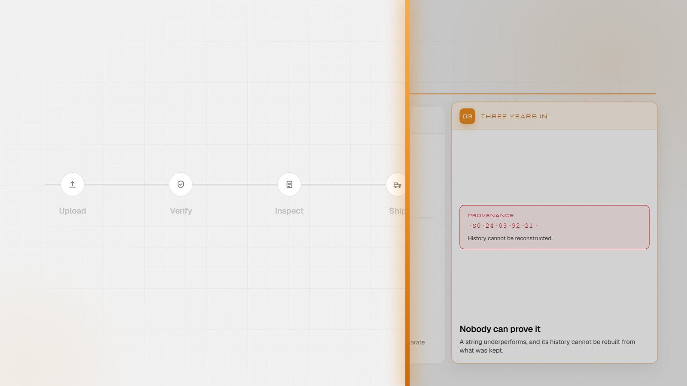
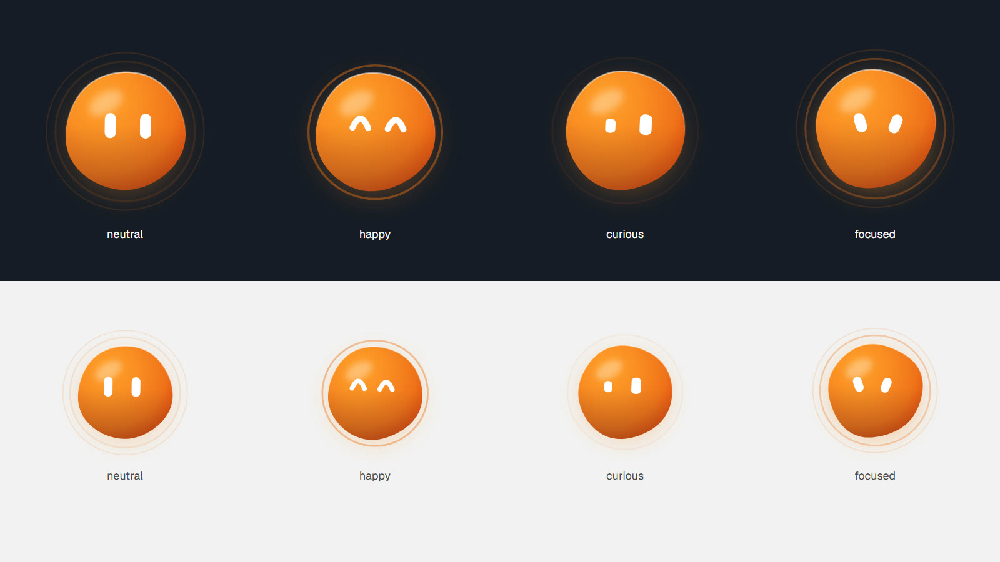

<div align="center">

# AiEmcee

**Narrated product demo videos, generated end to end from a text file.**

You write the script. Everything else — the voiceover, the screen recording,
the motion graphics, the titles, the transitions, the AI presenter, the sound
design, the cut — is produced by running a handful of commands.

No editor. No timeline. No manual sync.

<sub>*Emcee, as in master of ceremonies: the thing that narrates the show.*</sub>

<br>

[](https://github.com/mrigankad/AiEmcee/actions/workflows/ci.yml)
[](https://github.com/mrigankad/AiEmcee/releases)
[](https://nodejs.org)
[](LICENSE)

<br>

[Quickstart](docs/01-quickstart.md) ·
[Architecture](docs/02-architecture.md) ·
[Prompt library](docs/prompts/) ·
[Changelog](CHANGELOG.md) ·
[Troubleshooting](docs/09-troubleshooting.md)

<br>



<sub>Every frame below was produced by this repo. Nothing was touched by hand.</sub>

</div>

---

## What it does

```
narration.json ──▶ edge-tts, directed ──▶ tts/*.mp3 + durations.json
                                                  │
                   ┌──────────────────────────────┤
                   ▼                              ▼
       Playwright drives your app      timeline: every scene, transition,
       scenes.mjs ──▶ raw/*.webm       title, focus move and sound cue
       (or clip.mjs cuts a recording)  on the narration's clock
                   │                              │
                   └──────────────┬───────────────┘
                                  ▼
              Remotion renders the film  +  ffmpeg mixes the sound
                                  ▼
                 out/demo.mp4  +  poster  +  review stills
```

The video is a build artifact. When the product changes, you re-run the build
and get a new video — you do not re-edit anything.

```bash
npm run setup     # once
npm run build     # narrate → clip → capture → compose
```

---

## The idea that makes it work

**Audio is the metronome.**

Every normal video workflow does this backwards: record the picture, then fight
to fit a voiceover to it. That fight is the reason video editing is manual
work.

This inverts it.

1. Each narration line is synthesised first.
2. `ffprobe` measures its exact duration.
3. Those numbers go into `tts/durations.json`.
4. **Everything downstream cuts to them.** The recorder holds each scene until
   it outlasts its line. The compositor gives every scene exactly
   `narration + gap` on one timeline, then renders the picture and mixes the
   sound from that same timeline. Transitions, titles, camera moves, the
   avatar and the sound effects are all placed on it too.

Two timelines generated from one set of numbers cannot drift. That is the whole
trick, and it is why there is no sync step anywhere in this repo.

```
video    112.37s
audio    112.38s
drift    0.008s     ← printed on every build
```

---

## What comes out

<table>
<tr>
<td width="50%">

**Recorded product footage** — a real browser driving your real app, with a
virtual cursor that eases between targets and ripples on click. It reads as a
person, not as automation.

</td>
<td width="50%">

**Designed motion scenes** — for the parts of the story that are an argument
rather than a UI. Nobody needs to watch a slow scroll past marketing copy to be
told that testing is expensive.

</td>
</tr>
</table>



**Animated lower thirds**, drawn live over the footage: the brand bar grows,
the card unrolls, the words rise in.



**An end card**, held silent so the last narrated line has room to land.



**An AI presenter** that speaks the narration and shows it as word-by-word
captions: hosting the opening and closing full screen, then presenting the
product from the corner.


**Transitions between every scene**, like this brand wipe into the explainer
that matters most.



---

## Direction

A correct film is not automatically a good one. On top of the metronome,
every film is **directed**, with the craft of [/brag](https://github.com/latent-spaces/brag)
applied to long-form demos:

- **Transitions** between scenes, placed in the silent gap between lines so
  the voice always lands on a settled picture.
- **Focus moves** inside product footage. The camera eases in on the part of
  the UI that matters, dims the rest and names it. A screen recording stops
  asking the viewer to find the point on their own.
- **A tone**: `polished`, `default`, `cinematic`, `app-store` or `deadpan`.
  It sets transitions, camera, grade, motion springs and sound cues together.
- **A directed voice**: each line is spoken a sentence at a time, with pace
  and pitch from its intent (`hook`, `problem`, `feature`, `payoff`, …),
  deliberate pauses and `[beat]`s, and a mastering chain, so free TTS stops
  sounding flat. `npm run narrate -- --audition` compares voices by ear.
- **Sound design**: a music bed that ducks under the narration, effects cued
  from the edit, and the master normalised to -16 LUFS.
- **An AI presenter**: the Wayam orb, which speaks the narration (it moves
  with the voice) and shows it as word-by-word captions. It hosts openings and
  closings full screen, and presents product scenes from the corner. Four
  moods, blended between scenes; it steps aside for focus moves.
- **A poster frame** baked in as frame 0, and a **contact sheet** of every
  scene, transition, title and focus move to review before anyone watches.

```js
{
  id: "05-pdi",
  from: "clip",
  clip: { src: DEMO, start: 56.8, end: 70.35 },
  focus: [
    { at: 10.8, until: 12.8, box: [0.76, 0.87, 0.15, 0.06], label: "18,705 modules in one lot" },
  ],
},
```



Or let Claude do it: run **`/emcee`** in this repo. It inspects the footage,
places the focus moves, builds, reviews the stills and fixes what is wrong.
See **[docs/10-direction.md](docs/10-direction.md)**.

---

## Why it is built this way

**Screen capture for the product, motion graphics for the argument.**
Record the UI when the point is *look what it does*. Render a designed frame
when the point is *here is why this matters*.

**One scene, one browser context.** Each scene records to its own file. A scene
that goes wrong is re-recorded on its own in twenty seconds, instead of forcing
a full re-run — and a crash in scene nine does not cost you scenes one through
eight.

**Record against a production build.** A dev server can render an error
overlay, a hydration warning or a hot-reload toast at any moment, and there is
no way to remove that from footage afterwards.

**No generated media is committed.** Clone, `npm run build`, get the video.
The only binaries in the repo are a handful of small CC0 sound effects.

---

## Requirements

| Tool | Why | Install |
| --- | --- | --- |
| Node 20+ | runs the pipeline | [nodejs.org](https://nodejs.org) |
| ffmpeg + ffprobe | cuts clips, mixes and masters the sound, muxes | `winget install Gyan.FFmpeg` · `brew install ffmpeg` · `apt install ffmpeg` |
| edge-tts | the voiceover — free, no API key | `pip install edge-tts` |
| Chromium | drives your app | installed by `npm run setup` |

```bash
npm run doctor
```

Checks all of them and prints the fix next to anything missing.

```
  ok  node >= 20              v22.17.0
  ok  ffmpeg                  8.0.1
  ok  ffprobe                 8.0.1
  ok  edge-tts                7.2.7
  ok  playwright chromium     installed
  ok  remotion dependencies   installed
  ok  project config          6 narration lines, 4 captured + 2 motion scenes

All good. Run `npm run build`.
```

---

## Quickstart

**Scaffold a project** — the usual way. Creates a standalone project with no
runtime link back to this package, so upgrading the CLI never breaks a video
you already made.

```bash
npx @mrigankad/aiemcee init my-video
cd my-video

npm run setup       # node deps, remotion deps, Chromium
npm run doctor      # verify the toolchain

# start YOUR app in production mode, on the port in video.config.mjs
npm run build
```

<details>
<summary>The package lives on GitHub Packages, so npm needs one line of config</summary>

<br>

```bash
echo "@mrigankad:registry=https://npm.pkg.github.com" >> ~/.npmrc
npm login --scope=@mrigankad --registry=https://npm.pkg.github.com
```

GitHub Packages requires authentication even for public packages. If you would
rather skip that, clone the repo instead — it is the same thing.

</details>

**Or clone it** — identical result, no registry setup.

```bash
git clone https://github.com/mrigankad/AiEmcee.git my-video
cd my-video && npm run setup && npm run doctor && npm run build
```

Result: `out/demo.mp4`.

Full walkthrough — including how to seed data and choose a voice — in
**[docs/01-quickstart.md](docs/01-quickstart.md)**.

---

## Commands

| Command | Does |
| --- | --- |
| `npm run doctor` | preflight — every external tool, plus config validation |
| `npm run validate` | config + choreography checks, no external tools needed |
| `npm run narrate` | `narration.json` → directed `tts/*.mp3` + caption cues + `durations.json` (`-- --audition` to compare voices) |
| `npm run motion` | Remotion → preview renders of single motion scenes (optional) |
| `npm run capture` | Playwright drives your app → `raw/*.webm` |
| `npm run clip` | cuts scene footage out of an existing recording → `raw/*.mp4` |
| `npm run compose` | the directed film: Remotion picture + ffmpeg sound → `out/demo.mp4`, poster, review stills |
| `npm run build` | every stage, in order |
| `npm run studio` | Remotion Studio — scrubbable timeline, hot reload |

Every step takes an optional scene id, so you iterate on one thing at a time:

```bash
npm run narrate -- 05-cta      # reworded one line
npm run capture -- 05-cta      # re-record one scene
npm run motion  -- Problem     # preview one composition
npm run compose                # render the film
npm run compose -- --sound-only  # remix only, reusing the last picture
```

---

## What you actually edit

Four files. Everything else is machinery.

<table>
<tr><th align="left">File</th><th align="left">Holds</th></tr>
<tr><td><code>narration.json</code></td><td>the script — one entry per scene</td></tr>
<tr><td><code>scenes.mjs</code></td><td>what the browser does during each recorded scene</td></tr>
<tr><td><code>video.config.mjs</code></td><td>your app's URL, the running order, timing, voice</td></tr>
<tr><td><code>design.tokens.json</code></td><td>colours, fonts, frame size — read by both Node and Remotion</td></tr>
</table>

### The script

```json
{
  "id": "04-feature",
  "title": "The thing that wins the demo",
  "delivery": "feature",
  "text": "Now Acme explores your application like a real user. It crawls every page, maps complete journeys, and listens to network traffic. [beat] It discovers your APIs, automatically."
}
```

`delivery` is how the line is said (`hook`, `problem`, `explain`, `feature`,
`payoff`, `close`), and `[beat]` is a deliberate pause. `npm run narrate` then
tells you whether it is readable:

```
spoke   04-feature         feature   12.26s   26 words  127 wpm
```

130–150 wpm is the target for a measured film, 150–175 for an energetic one.
Fix pace by editing the words first; then set the pace per intent in
`tts.delivery`.

### The choreography

```js
"04-feature": async (s) => {
  await s.goto("/projects/demo/discovery");
  await s.wait(2.2);                                // land, let the viewer orient
  await s.scroll(240, 1500, s.main);                // "crawls every page"
  await s.click("text=API inventory", { after: 900 });  // "discovers your APIs"
  await s.wait(2.4);                                // hold while the point lands
},
```

You have 12.26 seconds. Break the line into beats, give each beat the seconds
it is spoken over. `capture` then tells you how close you got:

```
04-feature   narration 12.3s  drove 11.4s  clip 13.2s
```

### The running order

```js
sequence: [
  { id: "01-hook",      from: "capture" },
  { id: "02-problem",   from: "motion", composition: "Problem" },
  { id: "03-onboarding", from: "capture" },
  {
    id: "04-feature",
    from: "capture",
    lowerThird: { kicker: "Discovery", title: "The AI explores your app" },
  },
  { id: "05-cta", from: "capture" },
],
```

Reordering the film is reordering that array. Nothing else knows the order.

---

## Driving it with Claude Code

This repo is designed to be handed to an agent. The script, the choreography
and the motion graphics are all just text files.

**The one thing that decides whether it works: Claude cannot see your product.**
Point it at the product's repo, or paste the routes and selectors. Otherwise it
writes plausible choreography clicking buttons that do not exist, and you find
out fifteen timeouts later.

Four passes, each verified before the next:

```
1. script         → narration.json      → npm run narrate  → listen
2. sequence       → video.config.mjs    → npm run doctor
3. choreography   → scenes.mjs          → npm run capture  → watch
4. motion + brand → Remotion, tokens    → npm run motion   → check a frame
5. direction      → /emcee              → npm run compose  → review stills
```

Step 5 is a Claude Code skill that ships with the repo (`.claude/skills/emcee`).
It reads the footage on a grid, places focus moves on the real UI, picks the
tone, sets up the avatar, builds, reviews every still and fixes what is wrong.

Copy-paste prompts for each: **[docs/prompts/](docs/prompts/)**.
The reasoning behind them, plus a full worked session:
**[docs/08-prompting-claude.md](docs/08-prompting-claude.md)**.

---

## Making it yours

Rebranding is about twenty minutes. Everything reads from
`design.tokens.json`:

```json
{
  "video": { "width": 1600, "height": 900, "fps": 30 },
  "fonts": { "display": "Michroma", "sans": "Geist" },
  "color": {
    "brand": "#ff7b1c", "brandLight": "#ffa12b", "brandDeep": "#dc440c",
    "page": "#f2f2f2", "container": "#ffffff", "text": "#101010"
  }
}
```

Change the four brand stops, swap the two font imports in
`remotion/src/fonts.ts`, drop your mark in `remotion/public/`. The compositions
never need touching — if you find yourself editing one to change a colour, that
colour is hardcoded and should be a token.

Frame size lives there too, so switching to 1920×1080 or a square crop is one
edit. Dark mode is a surface inversion plus two known exceptions, both
documented.

**[docs/06-styling.md](docs/06-styling.md)** — the full design system.

---

## Repo map

```
narration.json          the script
scenes.mjs              browser choreography, one function per captured scene
video.config.mjs        project settings and the running order
design.tokens.json      design system, shared by the pipeline and Remotion

scripts/
  doctor.mjs            preflight
  validate.mjs          config checks, no external tools needed
  narrate.mjs           directed edge-tts + duration measurement
  capture.mjs           Playwright recording
  clip.mjs              cuts scenes out of an existing recording
  compose.mjs           timeline → picture → sound → master → review
  lib/
    config.mjs          config + narration loading, path helpers
    timeline.mjs        the one clock: scenes, transitions, titles, cues
    delivery.mjs        sentence-level prosody, pauses, voice mastering
    voice.mjs           voice envelope and caption timing, for the avatar
    sound.mjs           music bed, effects, ducking, loudness
    review.mjs          review stills, contact sheet, poster
    remotion.mjs        runs the Remotion CLI safely on every OS
    ffmpeg.mjs          ffmpeg / ffprobe wrappers
    scene.mjs           the Scene API your choreography is written against

remotion/
  render.mjs            preview renders of single motion scenes
  src/
    Root.tsx            composition registry
    scenes.ts           the copy for each motion scene
    theme.ts            reads design.tokens.json
    fonts.ts            Google Fonts, bundled rather than fetched at render time
    film/               the Film: transitions, footage camera, tones
    avatar/             the Wayam orb, captions, host and corner presenter
    components/Motion.tsx   FadeUp, KineticLine, Trace, Card, Eyebrow, Page
    compositions/       Problem, Pipeline, EndCard, LowerThird

assets/sfx/             sound effects (Kenney, CC0)
.claude/skills/emcee/   the /emcee directing skill
docs/                   the handbook
examples/parikshan/     a complete shipped film, annotated
```

---

## Documentation

| | |
| --- | --- |
| **[01 Quickstart](docs/01-quickstart.md)** | first video, start to finish |
| **[02 Architecture](docs/02-architecture.md)** | how the four stages fit together, and why |
| **[03 Writing narration](docs/03-writing-narration.md)** | script structure, pacing, the rules that make a demo watchable |
| **[04 Scene choreography](docs/04-scene-choreography.md)** | the Scene API, and how to time a browser to a voice |
| **[05 Motion graphics](docs/05-motion-graphics.md)** | Remotion compositions, timing, adding your own |
| **[06 Styling](docs/06-styling.md)** | the design system, and how to rebrand the whole thing |
| **[07 Compositing](docs/07-compositing.md)** | how the film is assembled: timeline, picture, sound |
| **[08 Prompting Claude](docs/08-prompting-claude.md)** | how to drive this repo with an agent |
| **[Prompt library](docs/prompts/)** | copy-paste prompts for each stage |
| **[09 Troubleshooting](docs/09-troubleshooting.md)** | every failure we have hit, and its fix |
| **[10 Direction](docs/10-direction.md)** | tone, transitions, focus moves, sound, poster, review |

---

## Worked example

**[examples/parikshan/](examples/parikshan/)** is a complete three-minute
product film as actually shipped — thirteen scenes, eight lower thirds, two
explainers. The real script, the real durations, the real choreography,
annotated with why each choice works:

- why the pipeline diagram sits *fourth* and not first
- why the longest scene in the film spends half its time admitting a limitation
- why the CTA returns to the exact frame the film opened on
- why scene six expands a collapsed section to approve something *on camera*
  rather than showing an already-approved list

Read it before writing your own script. It is the fastest way to internalise
the rhythm.

---

## How long it takes

| Stage | 3-minute video |
| --- | --- |
| narrate | ~1 min (seconds when cached) |
| capture | roughly real time — the browser drives the scenes live |
| compose | 3–5 min on a laptop; `--sound-only` in under a minute |

Writing the script is the long pole. The build is not.

---

## License

MIT. See [LICENSE](LICENSE).
